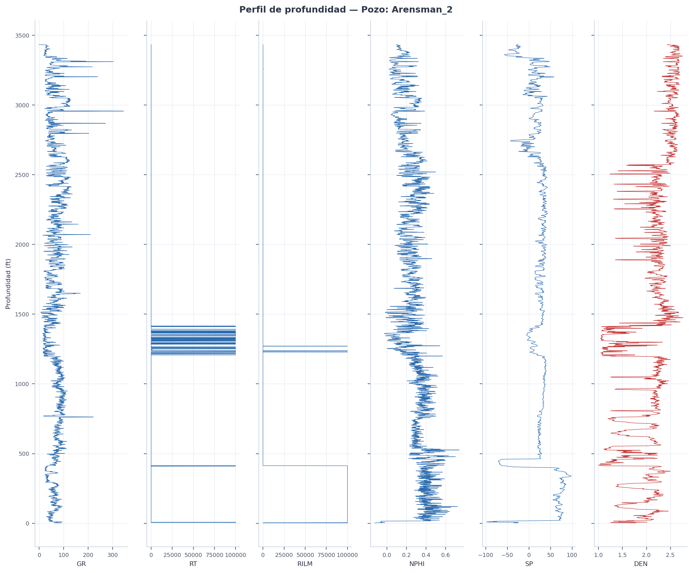
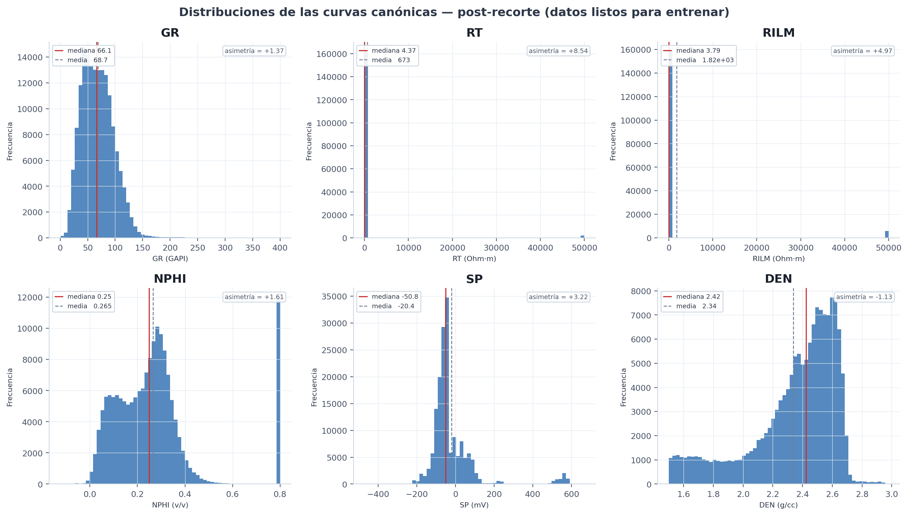
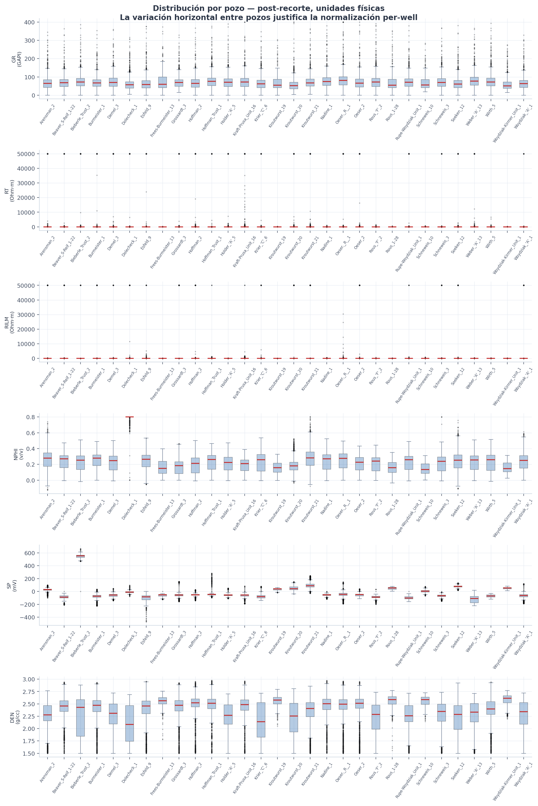
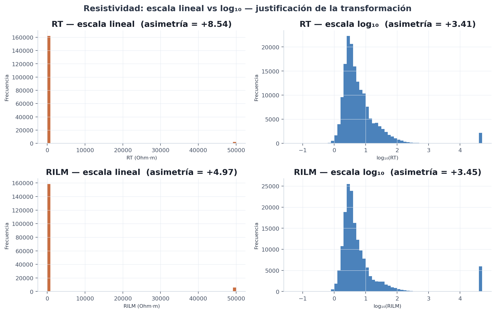
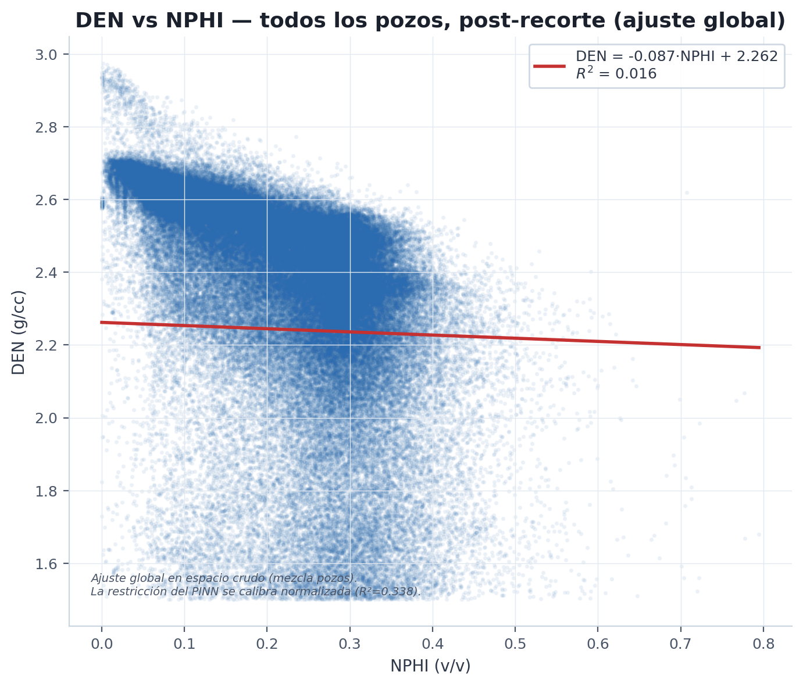
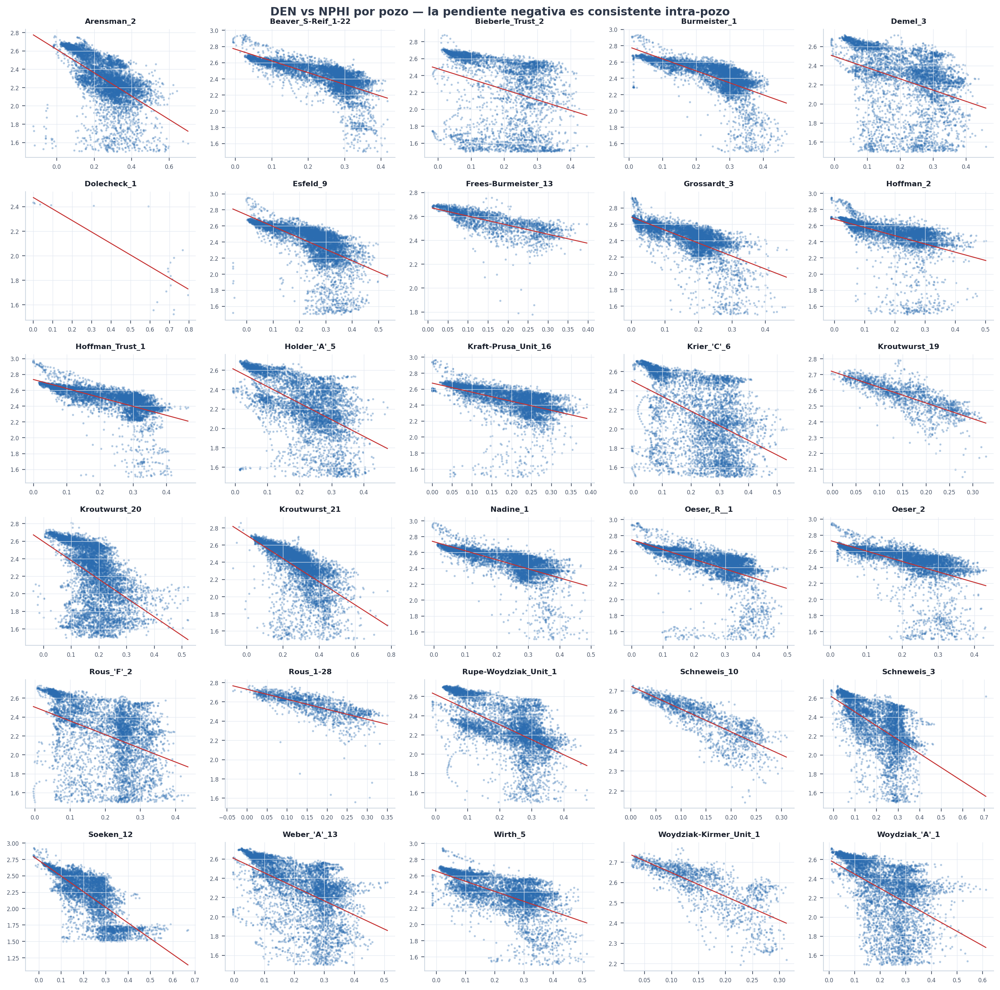
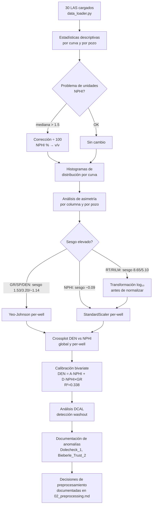

# 2. Análisis Exploratorio de Datos (EDA) — Campo Kraft Prusa

Documenta el análisis exploratorio realizado sobre los 30 pozos del dataset.
Los hallazgos del EDA fundamentan cada decisión del pipeline de preprocesamiento
descrito en `documentation/02_preprocessing.md`.

---

## 2.1 Introducción y objetivos del EDA

El EDA tiene cuatro objetivos específicos:

1. **Caracterizar distribuciones** por curva para identificar asimetría, outliers
   y problemas de unidad antes de aplicar cualquier transformación.
2. **Diagnosticar anomalías** conocidas en el campo Kraft Prusa (NPHI en %, centinelas
   de resistividad, zonas de washout).
3. **Cuantificar la relación física DEN–NPHI** que fundamenta el término regularizador
   de la PINN, incluyendo el ajuste del término bivariate con GR.
4. **Justificar empíricamente** la estrategia de normalización por columna (Yeo-Johnson
   vs. z-score estándar según sesgo).

El análisis se ejecuta con `scripts/02_run_eda.py`.

---

## 2.2 Dataset

| Métrica | Valor |
|---|---|
| Pozos válidos cargados | 30 |
| Registros totales (post-corrección unidades) | ~164,000 |
| Rango de profundidad | 0 – 3,483 ft |
| Paso de muestreo | 0.5 ft (mayoría de pozos) |
| Set externo (reservado, no analizado en EDA) | 3 pozos |
| Train pool (analizado) | 27 pozos |

Cada pozo es una serie en profundidad de las cinco curvas de entrada más el objetivo DEN.
La siguiente figura ilustra un pozo de ejemplo:

*__Fig. 2.0__ — Perfil en profundidad del pozo Arensman_2. Las cinco entradas
(GR, RT, RILM, NPHI, SP) en azul y el objetivo DEN en rojo. La estructura vertical
(intercalación de capas) es lo que el modelo debe aprender a mapear.*

---

## 2.3 Análisis de distribuciones por curva

Estadísticas descriptivas en espacio físico, post-corrección de unidades y post-eliminación
de centinelas, antes de cualquier normalización.

| Curva | Unidad | Media | Std | Asimetría | P25 | P50 | P75 | Notas |
|---|---|---:|---:|---:|---:|---:|---:|---|
| GR | GAPI | 69.1 | 30.8 | +1.53 | 46.1 | 66.5 | 88.0 | Bimodal arenas/lutitas; asimetría derecha → Yeo-Johnson |
| RT | Ohm·m | 1,300 | 11,257 | +8.65 | 2.77 | 4.41 | 9.56 | Fuertemente log-normal → log₁₀ previo + z-score |
| RILM | Ohm·m | 3,456 | 18,237 | +5.10 | 2.63 | 3.83 | 7.75 | Igual que RT |
| NPHI | v/v | 0.366 | 0.609 | +4.75 | 0.140 | 0.249 | 0.317 | Alta asimetría por Dolecheck_1; ≈ simétrico sin él → z-score |
| SP | mV | −24.5 | 124.7 | +3.20 | −80.5 | −52.1 | −5.5 | Sesgo extremo en algunos pozos (hasta 6.79) → Yeo-Johnson |
| DEN | g/cc | 2.231 | 0.424 | −1.14 | 2.054 | 2.382 | 2.545 | Asimetría izquierda consistente → Yeo-Johnson |

La estrategia de normalización se elige según el sesgo per-well observado en el EDA:

- **Yeo-Johnson** (PowerTransformer): columnas con sesgo consistente o severo (GR, SP, DEN).
- **StandardScaler** (z-score): columnas aproximadamente simétricas o ya linearizadas (RT, RILM post-log₁₀, NPHI).

Esta decisión está codificada en `src/preprocessing.py → SCALER_TYPE`.

*__Fig. 2.1__ — Distribución de cada curva (post-recorte de centinelas). Las líneas marcan
la mediana (roja) y la media (gris); el recuadro indica la asimetría. RT y RILM son
ilegibles en escala lineal (toda la masa colapsada cerca de 0), lo que motiva la
transformación logarítmica de la siguiente sección.*

La siguiente figura muestra la variación de cada curva **pozo a pozo**. La dispersión
horizontal entre cajas es variación geológica real (litología, herramienta, profundidad),
no error — y es la justificación central de la normalización per-well.

*__Fig. 2.2__ — Distribución por pozo en unidades físicas (post-recorte). Cada caja es el
IQR de un pozo; la línea roja es la mediana. El offset absoluto de SP en Bieberle_Trust_2
y los outliers resistivos de RT/RILM en carbonatos son visibles.*

---

## 2.4 Transformación logarítmica de resistividad

RT y RILM siguen una distribución log-normal: la mayoría de las muestras se concentran
en el rango 1–10 Ohm·m, pero los máximos legítimos (carbonatos resistivos) alcanzan
valores de $10^4$ Ohm·m. En escala lineal, la normalización colapsa el 99 % de los
datos en un intervalo estrecho.

La transformación aplicada es:

$$x_{\log} = \log_{10}(x)$$

| Estadístico | RT lineal (post-centinelas) | RT log₁₀ |
|---|---:|---:|
| Asimetría | +8.65 | ≈ 0 |
| P25 – P75 | 2.77 – 9.56 Ohm·m | 0.44 – 0.98 |
| Rango efectivo (post-clip) | 0.05 – 50,000 Ohm·m | −1.3 – 4.7 |

Tras el log transform, la distribución es aproximadamente simétrica y el StandardScaler
per-well produce una señal normalizada útil para el optimizador.

*__Fig. 2.3__ — Comparación de RT y RILM en escala lineal (naranja) vs log₁₀ (azul). La
asimetría cae de +8.65 a ≈0 (RT) y de +5.10 a ≈0 (RILM), confirmando la naturaleza
log-normal de la resistividad y justificando la transformación.*

Se usa log₁₀ (y no logaritmo natural) por convención en petrología: una década =
una unidad en la escala del trabajo de campo.

**Implementación**: `src/preprocessing.py → apply_log_rt()`

---

## 2.5 Relación física DEN–NPHI

### 2.5.1 Crossplot global vs per-well

El crossplot de todos los pozos mezclados muestra un R² muy bajo, que mejora
sustancialmente al analizar cada pozo por separado:

| Contexto | R² | Interpretación |
|---|---:|---|
| Global (todos los pozos mezclados, raw) | 0.017 | Artefacto del mezclado: distintos offsets geológicos de DEN y NPHI por pozo destruyen la correlación |
| Per-well (mediana) | 0.277 | Relación negativa clara dentro de cada pozo (la mayoría de los pozos) |
| Per-well (media) | 0.298 | — |

La correlación **negativa** es físicamente correcta: mayor porosidad neutrón (más fluido
en los poros) implica menor densidad bulk.

*__Fig. 2.4__ — Crossplot DEN vs NPHI con todos los pozos mezclados (espacio crudo,
post-recorte). El ajuste global tiene $R^2$ bajo porque mezcla pozos con offsets
absolutos distintos; la restricción del PINN se calibra per-well en espacio normalizado.*

*__Fig. 2.5__ — El mismo crossplot separado por pozo (small multiples). La pendiente
negativa es consistente intra-pozo, confirmando que la relación física es real y que el
$R^2$ global bajo es un artefacto del mezclado.*

### 2.5.2 Ajuste bivariate con término de interacción GR

La calibración en espacio Yeo-Johnson + z-score normalizado (27 pozos del train pool)
produce:

$$\widehat{\text{DEN}}_{norm} = A \cdot \text{NPHI}_{norm} + D \cdot \left(\text{NPHI}_{norm} \times \text{GR}_{norm}\right)$$

| Coeficiente | Valor | Descripción |
|---|---:|---|
| $A$ | −0.5563 | Pendiente principal NPHI → DEN |
| $D$ | +0.0864 | Corrección litológica (interacción NPHI × GR) |
| $R^2$ | 0.338 | vs. 0.330 del modelo univariado (solo NPHI) |

La mejora de $R^2$ de 0.330 a 0.338 con el término de interacción es modesta pero
consistente. El término $D \cdot (\text{NPHI} \times \text{GR})$ captura el efecto de
arcillosidad: en lutitas (GR alto), la pendiente NPHI–DEN se atenúa porque las arcillas
tienen alta porosidad aparente neutrón pero densidad intermedia.

**Implementación**: `src/physics.py → den_from_nphi()`, coeficientes `A_PHYS`, `D_PHYS`.

### 2.5.3 Excepción: Dolecheck_1

Dolecheck_1 es el único pozo con pendiente positiva en el crossplot normalizado.
Los valores de NPHI en este pozo oscilan entre 0.81 y 5.69 v/v (rango físicamente
imposible; posible inconsistencia de escala residual en el LAS original). Tras el
pipeline de preprocesamiento, NPHI queda prácticamente constante, y el pozo se
mantiene en el dataset con la advertencia documentada.

---

## 2.6 Anomalías documentadas

| Anomalía | Pozo(s) | Descripción | Tratamiento |
|---|---|---|---|
| NPHI fuera de rango físico | Dolecheck_1 | Valores NPHI entre 0.81–5.69 v/v (corrección % → v/v correcta, pero escala residual en LAS original) | Se mantiene en el dataset; detectores de consenso marcan los outliers; NPHI queda constante tras interpolación |
| SP en escala absoluta | Bieberle_Trust_2 | SP registrado en 0–666 mV (referencia absoluta al nivel del mar en lugar de diferencial) | El voting consensus no elimina estas filas porque la distribución intra-pozo es coherente; la normalización per-well absorbe el offset |
| Zonas de washout por DCAL | Varios pozos | DCAL > Q75 + 1.5×IQR en profundidades con hoyo ensanchado | `flag_washout_rows()` → NaN en todas las features y DEN; la interpolación posterior cubre los huecos |
| Centinelas de resistividad grandes | Varios pozos | RT o RILM > 1×10⁶ Ohm·m codificados por herramientas antiguas (1970–1980) | Reemplazados por NaN en `src/data_loader.py` antes del pipeline de preprocesamiento |

---

## 2.7 Decisiones de preprocesamiento

| Decisión | Elección | Alternativa descartada | Razón de la elección |
|---|---|---|---|
| Corrección NPHI | ÷100 si mediana > 1.5 o unidad "%" en LAS | Usar valores en % | La escala equivocada rompe la restricción física DEN–NPHI |
| Centinelas de resistividad | RT/RILM > 1×10⁶ → NaN | Solo centinelas clásicos (−9999, −999.25) | Herramientas antiguas KGS codifican null como 1e9 |
| Outliers de features | Voting consensus (≥2 de 5 detectores) | Fixed clip a límites físicos | El clip fijo causaba pérdidas del 100% de filas en pozos con anomalías sistemáticas |
| Washout DCAL | `flag_washout_rows()` umbral Q75+1.5×IQR → NaN | Ignorar DCAL | Los intervalos de washout producen DEN y NPHI no confiables |
| Transformación RT/RILM | log₁₀ | Sin transformación | La asimetría de +8.65 comprime el 99% de los datos en la normalización lineal |
| Normalización por columna | Yeo-Johnson para GR/SP/DEN; z-score para RT/RILM/NPHI | Min-max per-well (pipeline anterior) | La normalización anterior producía MAE=0.183; Yeo-Johnson reduce a MAE=0.134 |
| Protocolo de evaluación | LOWO per-well | K-fold estándar | LOWO respeta la estructura geológica; sin mezcla de profundidades entre pozos |

---

## 2.8 Flujo de análisis EDA

---

*Fuente del análisis: `scripts/02_run_eda.py`*
*Fuente del código: `src/data_loader.py`, `src/preprocessing.py`*
*Coeficientes físicos: `src/physics.py`*
