# 3. Pipeline de Preprocesamiento

Descripción completa del pipeline de limpieza y transformación que convierte los archivos
LAS crudos del campo Kraft Prusa en tensores PyTorch listos para entrenar. Cada paso está
justificado empíricamente con los 30 pozos del dataset.

---

## 3.1 Introducción

Los registros de pozo del campo Kraft Prusa presentan cinco características que hacen
que un preprocesamiento ingenuo produzca datos silenciosamente corruptos:

| Problema | Impacto si se ignora |
|---|---|
| CNLS almacenado en % en lugar de v/v | NPHI entre 14–31 en vez de 0.14–0.31; relación física DEN–NPHI con escala equivocada |
| Centinelas de resistividad grandes (1×10⁹, 1×10¹¹ Ohm·m) | RT/RILM no capturados por filtros clásicos (−9999); distorsionan normalización y log transform |
| Zonas de hoyo ensanchado (*borehole washout*) | Lecturas de DEN y NPHI no representativas de la formación real |
| Outliers estadísticos por pozo | Spikes de herramienta o anomalías puntuales; detectores fijos causan pérdida masiva de datos |
| Variación inter-pozo de escala absoluta | GR en carbonatos 0–50 GAPI vs. en shales 0–200 GAPI; normalización global distorsiona el aprendizaje |

El pipeline está dividido en dos módulos con responsabilidades bien separadas:

- **`src/data_loader.py`**: correcciones de adquisición (unidades, centinelas, mapeo de mnemonics).
- **`src/preprocessing.py`**: transformaciones estadísticas para el modelo (washout, outliers, normalización).

---

## 3.2 Flujo completo del pipeline

```mermaid
flowchart TD
    A["LAS crudos<br/>Kraft Prusa"] --> B["data_loader.py<br/>load_well"]
    B --> C["Mapeo mnemonics<br/>GR, RT, RILM, NPHI, SP, DEN, DCAL"]
    C --> D["Correcciones de adquisición<br/>NPHI % → v/v<br/>Centinelas RT>1e6 → NaN<br/>Centinelas LAS -9999 → NaN"]
    D --> E["dropna curvas canónicas<br/>≥100 filas requeridas"]
    E --> F["DataFrame crudo<br/>unidades físicas correctas"]
    F --> G["preprocess_well<br/>src/preprocessing.py"]
    G --> G1["Paso 1: Washout DCAL<br/>DCAL > Q75+1.5×IQR → NaN features+DEN"]
    G1 --> G2["Paso 2: Voting consensus outliers<br/>≥2 de 5 detectores → NaN → interpolación lineal"]
    G2 --> G3["Paso 3: Drop DEN inválido<br/>DEN < 1.5 o DEN > 3.1 g/cc → eliminar fila"]
    G3 --> G4["Paso 4: DCAL_WEIGHT<br/>calidad caliper en unidades originales"]
    G4 --> G5["Paso 5: log₁₀ RT y RILM<br/>distribución log-normal"]
    G5 --> G6["Paso 6: Normalización per-well<br/>GR/SP/DEN: Yeo-Johnson+zscore<br/>RT/RILM/NPHI: StandardScaler"]
    G6 --> G7["DCAL_WEIGHT adjunto<br/>columna no normalizada"]
    G7 --> H["DataFrame normalizado<br/>≈ N 0,1 por columna"]
    H --> I["WellDataset<br/>tensores PyTorch"]
    I --> J["Esta es la data que<br/>entrena el modelo<br/>LOWO · 27 folds"]
```



---

## 3.3 Carga de datos — `src/data_loader.py`

### 3.3.1 Mapeo de mnemonics

El campo Kraft Prusa usa distintos mnemonics según la herramienta y el año de registro.
El diccionario `_MNEMONIC_MAP` en `src/data_loader.py` normaliza los nombres a los seis
canónicos internos del proyecto. El primer mnemónico que coincida para cada nombre
canónico se usa; los duplicados se descartan.

```
RILD → RT       CNLS/CNPOR/CNSS/CNDL/... → NPHI
RILM → RILM     RHOB → DEN
GR   → GR       DCAL → DCAL (opcional)
SP   → SP
```

Criterio de rechazo: si alguna de las seis curvas canónicas (GR, RT, RILM, NPHI, SP, DEN)
falta, el pozo se descarta. DCAL es opcional: si está presente, se carga.

### 3.3.2 Corrección NPHI % → v/v

Todos los archivos LAS del campo Kraft Prusa almacenan CNLS en porcentaje (valores típicos
14–31 %). La convención del sector es fracción v/v (0.14–0.31 v/v).

Si la unidad en la cabecera del LAS contiene `%` o si la mediana del NPHI no nulo supera 1.5,
se aplica la corrección:

$$\text{NPHI}_{corr} = \frac{\text{NPHI}_{raw}}{100}$$

| Estado | NPHI media | Interpretación |
|---|---:|---|
| Sin corrección | 36.6 | Imposible en v/v; confirma escala % |
| Con corrección | 0.27 v/v | Físicamente correcto para sedimentos clásticos |

### 3.3.3 Centinelas de resistividad grandes

Las herramientas de inducción usadas en Kraft Prusa (décadas de 1970–1980) codifican
datos faltantes como 1×10⁹ o 1×10¹¹ Ohm·m. Estos valores no son capturados por los
centinelas clásicos del formato LAS 2.0 (−9999.0, −999.25).

El umbral de eliminación es:

$$|\text{RT}| > 1 \times 10^6 \;\text{Ohm·m} \;\rightarrow\; \text{NaN}$$

El máximo físico realista para una formación (carbonatos muy resistivos) es del orden
de 10,000–50,000 Ohm·m. Valores superiores a 1×10⁶ son, sin excepción, artefactos.

---

## 3.4 Filtro de washout por caliper DCAL

Los intervalos de *borehole washout* (hoyo ensanchado) son profundidades donde el
trépano ha erosionado la formación más allá de su diámetro nominal. En estas zonas,
las herramientas de densidad y neutrón no leen la formación sino el lodo de perforación
o la mezcla formación–lodo, produciendo valores de DEN y NPHI no representativos.

El filtro se implementa en `src/preprocessing.py → flag_washout_rows()`. El umbral
de washout es estadístico per-well:

$$\text{umbral} = Q_{75}(\text{DCAL}) + 1.5 \times IQR(\text{DCAL})$$

Las filas donde DCAL supera el umbral reciben NaN en todas las features y en DEN.
Las filas no se eliminan; los NaN se recuperan parcialmente con la interpolación del
paso siguiente. Si DCAL no está presente en el pozo, el DataFrame se retorna sin cambios.

---

## 3.5 Detección de outliers por consenso de votación

Reemplaza el clip a límites físicos fijos del pipeline anterior. Un valor se marca como
outlier solo si **≥ 2 de 5 detectores independientes** coinciden:

| Detector | Escala de evaluación | Criterio | Umbral |
|---|---|---|---|
| MAD (Iglewicz & Hoaglin) | Lineal (log₁₀ para RT/RILM) | Modified Z-score | Threshold = 3.5 |
| IQR de Tukey | Lineal (log₁₀ para RT/RILM) | Fuera de Q1−k·IQR o Q3+k·IQR | k = 3.0 |
| Z-score estándar | Lineal (log₁₀ para RT/RILM) | Más de n·σ de la media | Threshold = 3.0 |
| Percentil | Lineal (log₁₀ para RT/RILM) | Fuera del intervalo [p₁, p₂] | p₁=1.5 %, p₂=98.5 % |
| Isolation Forest | Lineal (log₁₀ para RT/RILM) | Anomalía según árbol de aislamiento | Contamination = 0.05 |

Los valores marcados como outlier se reemplazan por NaN. La recuperación se realiza con:

1. Interpolación lineal (límite de 5 pasos en profundidad).
2. Forward fill para los NaN en el borde superior del pozo.
3. Backward fill para los NaN en el borde inferior del pozo.

Todas las filas del pozo se preservan; solo los valores outlier individuales se
corrigen, manteniendo disponible el target DEN donde es válido.

**Implementación**: `src/preprocessing.py → flag_outliers_consensus()`, `clip_features_to_bounds()`

---

## 3.6 Filtro del objetivo DEN

El target DEN se trata diferente a las features: si el valor de DEN en una fila es
físicamente imposible, **esa fila se elimina completamente**.

| Límite | Valor | Justificación petrológica |
|---|---:|---|
| Mínimo | 1.5 g/cc | Por debajo: washout severo (herramienta lee lodo) o fallo electrónico; ninguna litología legítima |
| Máximo | 3.1 g/cc | Por encima: herramienta pegada a la pared o error de calibración; anhidrita densa ≈ 2.87 g/cc |

Los features pueden ser imperfectos siempre que el target sea correcto. Si el target
está corrupto, la fila completa es basura para el entrenamiento.

**Implementación**: `src/preprocessing.py → filter_invalid_target_rows()`, `TARGET_BOUNDS`

---

## 3.7 Transformación logarítmica de resistividad

RT y RILM siguen distribución log-normal. En escala lineal, la asimetría de RT es
+8.65: el 75 % de los valores cae entre 0.1 y 10 Ohm·m pero el máximo post-depuración
es 50,000 Ohm·m. La normalización per-well comprimiría toda la señal útil en una franja
estrecha del rango normalizado.

La transformación aplicada, en `src/preprocessing.py → apply_log_rt()`, es:

$$\text{RT}_{log} = \log_{10}(\text{RT}), \quad \text{RILM}_{log} = \log_{10}(\text{RILM})$$

Tras esta transformación, RT y RILM tienen asimetría ≈ 0 y el StandardScaler produce
una señal centrada sin distorsión de gradientes.

---

## 3.8 Normalización per-well según sesgo de distribución

Cada pozo se normaliza de forma completamente independiente. La estrategia por columna
se elige según el sesgo observado en el EDA (`src/preprocessing.py → SCALER_TYPE`):

| Columna | Unidad | Sesgo medio per-well | Estrategia | Justificación |
|---|---|---:|---|---|
| GR | GAPI | +1.53 | Yeo-Johnson + z-score | Sesgo derecho consistente en todos los pozos |
| RT | Ohm·m | ≈ 0 (post log₁₀) | StandardScaler (z-score) | Log₁₀ ya linealiza la distribución |
| RILM | Ohm·m | ≈ 0 (post log₁₀) | StandardScaler (z-score) | Ídem |
| NPHI | v/v | −0.09 | StandardScaler (z-score) | Aproximadamente simétrico (sin Dolecheck_1) |
| SP | mV | hasta +6.79 | Yeo-Johnson + z-score | Sesgo extremo en varios pozos |
| DEN | g/cc | −1.64 | Yeo-Johnson + z-score | Sesgo izquierdo consistente |

La normalización Yeo-Johnson produce una salida aproximadamente $\mathcal{N}(0, 1)$
para todas las columnas. Esto mejora los gradientes del optimizador Adam y es
compatible con la restricción física en espacio normalizado.

El scaler de cada pozo se ajusta **solo** sobre los datos de ese pozo (`fit_scaler()`).
En el protocolo LOWO, los scalers son completamente independientes entre pozos, lo que
garantiza que no hay data leakage.

---

## 3.9 Peso de caliper DCAL_WEIGHT

Incluso después del filtro de washout, los intervalos con hoyo ligeramente ensanchado
(pero por debajo del umbral de eliminación) tienen mediciones menos fiables. El peso
DCAL_WEIGHT cuantifica la calidad del entorno de hoyo por profundidad:

$$w_i = \text{clip}\!\left(1 - \frac{\text{DCAL}_i - Q_{25}}{Q_{90} - Q_{25}},\; 0,\; 1\right)$$

- $w_i = 1$: hoyo en calibre nominal (DCAL ≈ Q25 del pozo).
- $w_i \rightarrow 0$: hoyo muy ensanchado (DCAL ≈ Q90 del pozo).
- Si DCAL no está presente: $w_i = 1$ para todas las profundidades.

DCAL_WEIGHT se calcula **antes** de la normalización (en unidades originales) y se
almacena como columna adicional en el DataFrame procesado. El `WellDataset` lo expone
como tensor independiente; `src/train.py` lo pasa a la función de pérdida física
(`src/physics.py → physics_loss()`) para ponderar el término regularizador.

**Implementación**: `src/preprocessing.py → compute_dcal_weight()`

---

## 3.10 WellScaler y transformada inversa

`WellScaler` almacena un transformador por columna y los límites observados del espacio
normalizado (`norm_bounds`). La función `inverse_transform_target()` usa estos límites
para clipear las predicciones del modelo antes de aplicar la inversa Yeo-Johnson:

```python
values_clipped = clip(values, lo=norm_bounds[DEN][0], hi=norm_bounds[DEN][1])
den_gcc = PowerTransformer.inverse_transform(values_clipped)
```

Este clip previene NaN en la inversa Yeo-Johnson cuando las predicciones del modelo
caen fuera del dominio de la transformación inversa (que tiene cota finita para
distribuciones con $\lambda$ negativo, como DEN).

**Implementación**: `src/preprocessing.py → WellScaler.inverse_transform_target()`

---

## 3.11 Garantías de calidad del dataset final

| Propiedad | Valor verificado |
|---|---|
| Pozos con datos | 30 / 30 (100 %) |
| NaN en cualquier columna de features o target | 0 |
| DEN target en rango físico | 100 % (todas las filas fuera de [1.5, 3.1] g/cc eliminadas) |
| Error de inverse transform DEN | < 1×10⁻⁴ g/cc |
| Contaminación cruzada LOWO | Ninguna (scalers independientes por pozo) |

---

## 3.12 Referencia de código

| Función / Clase | Archivo | Responsabilidad |
|---|---|---|
| `load_well()` | `src/data_loader.py` | Carga LAS, mapeo mnemonics, corrección unidades y centinelas |
| `load_field()` | `src/data_loader.py` | Itera directorio, retorna dict well_id → DataFrame |
| `flag_washout_rows()` | `src/preprocessing.py` | Detecta y marca NaN en intervalos de washout por DCAL |
| `flag_outliers_consensus()` | `src/preprocessing.py` | Voting consensus con 5 detectores |
| `clip_features_to_bounds()` | `src/preprocessing.py` | Aplica voting consensus y recupera por interpolación |
| `filter_invalid_target_rows()` | `src/preprocessing.py` | Drop filas con DEN fuera de TARGET_BOUNDS |
| `apply_log_rt()` | `src/preprocessing.py` | log₁₀ en RT y RILM |
| `compute_dcal_weight()` | `src/preprocessing.py` | Calcula peso DCAL_WEIGHT por profundidad |
| `fit_scaler()` | `src/preprocessing.py` | Ajusta WellScaler per-well con la estrategia SCALER_TYPE |
| `WellScaler.transform()` | `src/preprocessing.py` | Aplica normalización Yeo-Johnson / z-score |
| `WellScaler.inverse_transform_target()` | `src/preprocessing.py` | Desnormaliza predicciones DEN a g/cc con clip anti-NaN |
| `preprocess_well()` | `src/preprocessing.py` | Orquesta los 6 pasos para un pozo |
| `preprocess_wells()` | `src/preprocessing.py` | Itera todos los pozos de forma independiente |
