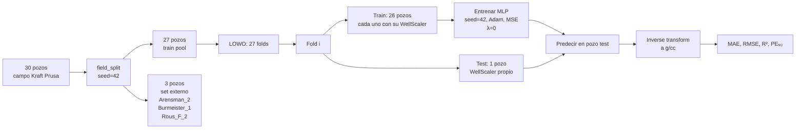

# 4. Modelo Base MLP — Evaluación LOWO

Establece el rendimiento de referencia del MLP supervisado puro (λ=0, sin restricción
física) sobre el campo Kraft Prusa mediante validación cruzada Leave-One-Well-Out.
Todas las métricas de la PINN (Phase 3) se comparan contra estos valores.

---

## 4.1 Introducción

El modelo base (*baseline*) es un MLP estándar entrenado con MSE puro sobre los datos
normalizados. Su propósito es doble:

1. **Cuantificar el límite inferior de la PINN**: λ=0 reproduce exactamente el baseline
   (verificado por `test_lambda_phys_zero_same_as_no_physics`).
2. **Establecer una referencia honesta**: el protocolo LOWO garantiza que ningún pozo de
   prueba contamina el entrenamiento, lo que hace comparables los resultados entre folds.

El pipeline de preprocesamiento Yeo-Johnson + z-score (implementado en Phase 2) produce
resultados significativamente mejores que el pipeline anterior con min-max. La incorporación
del filtro de *washout* DCAL en Phase 3 introduce un ajuste adicional: al eliminar zonas
de hoyo ensanchado (~8.6 % de filas por pozo, máx. 25 %), las métricas de R² disminuyen
porque se remueven también los picos espurios de alta varianza en DEN — lo que hace la
comparación más honesta. El MAE apenas cambia porque los errores grandes en washout
también desaparecen.

| Pipeline | MAE medio (g/cc) | R² medio | Nota |
|---|---:|---:|---|
| Min-max per-well (pipeline anterior) | 0.183 | −0.174 | NaN en 13 folds por dominio Yeo-Johnson |
| Yeo-Johnson + z-score, sin filtro washout | 0.134 | 0.414 | Run previo sin DCAL filter |
| **Yeo-Johnson + z-score + filtro washout (actual)** | **0.140** | **0.276** | Elimina ~10 % filas de baja calidad; R² más honesto |

El descenso de R² de 0.414 a 0.276 no es una regresión del modelo. Los registros DEN en
zonas de washout están dominados por ruido instrumental; eliminarlos reduce la varianza
total del target, lo que deflacta el R² global sin reflejar un peor ajuste real.

---

## 4.2 Protocolo de evaluación LOWO

Cada fold es completamente independiente:

1. Los 26 pozos de entrenamiento se preprocesan individualmente con su propio `WellScaler`.
2. El pozo de prueba se preprocesa con su propio `WellScaler` — sin información cruzada.
3. El modelo se inicializa desde cero con `set_seed(42)` antes de cada fold.
4. Las predicciones se invierten a g/cc (mediante `WellScaler.inverse_transform_target()`)
   antes de calcular métricas.

El set externo (3 pozos) está reservado para la validación final de la PINN y no
participa en ningún fold LOWO ni en la calibración de hiperparámetros.

**Fuentes**: `src/lowo.py`, `scripts/03_train_baseline.py`

---

## 4.3 Arquitectura MLP

La arquitectura es deliberadamente simple: suficiente capacidad para aprender los
patrones del campo sin sobreajustar los pocos miles de muestras disponibles por fold.

| Capa | Dimensión entrada | Dimensión salida | Activación |
|---|---:|---:|---|
| Input | — | 5 | — |
| Hidden 1 | 5 | 64 | ReLU |
| Hidden 2 | 64 | 64 | ReLU |
| Hidden 3 | 64 | 32 | ReLU |
| Output | 32 | 1 | Ninguna (lineal) |

La salida lineal permite predicciones en cualquier rango real; la inversión mediante
`WellScaler` devuelve los valores a g/cc.

### 4.3.1 Configuración de entrenamiento

| Parámetro | Valor |
|---|---|
| Optimizador | Adam |
| Tasa de aprendizaje | 1×10⁻³ |
| Función de pérdida | MSE (espacio normalizado) |
| Épocas máximas | 500 |
| Early stopping patience | 20 épocas |
| min_delta early stopping | 1×10⁻⁵ |
| Fracción de validación interna | 15 % |
| Batch size | 512 |
| λ físico | 0.0 (baseline puro) |
| Semilla aleatoria | 42 (aplicada antes de cada fold) |

El checkpoint del mejor modelo (menor val loss durante el entrenamiento) se restaura al
finalizar para que la evaluación se haga sobre la mejor iteración del fold.

**Fuentes**: `src/model.py`, `src/train.py → TrainConfig`

---

## 4.4 Resultados por pozo

Métricas en **g/cc** (post inverse-transform), ordenadas por R² descendente.
PE₉₀ = percentil 90 del error absoluto.

| Pozo | MAE (g/cc) | RMSE (g/cc) | R² | PE₉₀ (g/cc) |
|---|---:|---:|---:|---:|
| Oeser,_R__1 | 0.0544 | 0.0783 | 0.6378 | 0.1188 |
| Schneweis_10 | 0.0376 | 0.0533 | 0.6328 | 0.0850 |
| Nadine_1 | 0.0568 | 0.0795 | 0.6297 | 0.1257 |
| Kroutwurst_19 | 0.0370 | 0.0546 | 0.6183 | 0.0811 |
| Grossardt_3 | 0.0630 | 0.1003 | 0.5829 | 0.1336 |
| Beaver_S-Reif_1-22 | 0.0755 | 0.1166 | 0.5460 | 0.1584 |
| Kraft-Prusa_Unit_16 | 0.0643 | 0.0887 | 0.5429 | 0.1332 |
| Rous_1-28 | 0.0462 | 0.0664 | 0.5282 | 0.0997 |
| Frees-Burmeister_13 | 0.0391 | 0.0552 | 0.5198 | 0.0789 |
| Hoffman_Trust_1 | 0.0629 | 0.1076 | 0.5054 | 0.1342 |
| Oeser_2 | 0.0568 | 0.0912 | 0.4929 | 0.1213 |
| Woydziak-Kirmer_Unit_1 | 0.0544 | 0.0816 | 0.4660 | 0.1354 |
| Hoffman_2 | 0.0575 | 0.0959 | 0.4320 | 0.1232 |
| Wirth_5 | 0.1194 | 0.1790 | 0.3972 | 0.2544 |
| Woydziak_'A'_1 | 0.2009 | 0.2676 | 0.2679 | 0.4588 |
| Schneweis_3 | 0.1626 | 0.2122 | 0.2650 | 0.3449 |
| Krier_'C'_6 | 0.2611 | 0.3228 | 0.2345 | 0.5176 |
| Kroutwurst_21 | 0.1667 | 0.2274 | 0.2322 | 0.3654 |
| Weber_'A'_13 | 0.1838 | 0.2543 | 0.2169 | 0.4553 |
| Rupe-Woydziak_Unit_1 | 0.1303 | 0.1851 | 0.0879 | 0.2983 |
| Soeken_12 | 0.2502 | 0.3173 | −0.0110 | 0.5363 |
| Bieberle_Trust_2 | 0.3069 | 0.4155 | −0.0392 | 0.7800 |
| Holder_'A'_5 | 0.1886 | 0.2514 | −0.0517 | 0.4204 |
| Kroutwurst_20 | 0.2484 | 0.3034 | −0.0822 | 0.4926 |
| Esfeld_9 | 0.1709 | 0.2360 | −0.1131 | 0.3634 |
| Demel_3 | 0.2618 | 0.3384 | −0.2822 | 0.5688 |
| Dolecheck_1 | 0.4132 | 0.4951 | −0.7992 | 0.8233 |

---

## 4.5 Métricas agregadas

Calculadas sobre los 27 folds del train pool (media y desviación estándar).

| Métrica | Media | Desv. std |
|---|---:|---:|
| MAE (g/cc) | **0.1396** | 0.0988 |
| RMSE (g/cc) | **0.1880** | 0.1197 |
| R² | **0.2762** | 0.3397 |
| PE₉₀ (g/cc) | **0.3040** | 0.2136 |

Resumen del rendimiento general:

- **20 de 27 pozos** presentan R² positivo.
- La **mediana de R² = 0.397** es más representativa del comportamiento típico que
  la media (la media está deprimida por los outliers negativos).
- Siete pozos presentan R² negativo: Dolecheck_1 (−0.799), Demel_3 (−0.282),
  Esfeld_9 (−0.113), Kroutwurst_20 (−0.082), Holder_'A'_5 (−0.052),
  Bieberle_Trust_2 (−0.039) y Soeken_12 (−0.011).
  Dolecheck_1 está documentado como caso anómalo desde el EDA (NPHI 0.81–5.69 v/v).

---

## 4.6 Análisis y discusión

### 4.6.1 Pozos con buen rendimiento (R² > 0.6)

Cuatro pozos alcanzan R² > 0.6, con el mejor en Oeser,_R__1 (R²=0.638, MAE=0.054 g/cc).
Estos pozos comparten características favorables:

- Registros de buena calidad sin anomalías de unidad.
- Varianza de DEN suficientemente alta para que R² sea informativo.
- Respuesta de NPHI correlacionada con DEN (relación física activa en la formación).

Son los pozos donde la PINN debe mantener o mejorar el rendimiento sin degradar.

### 4.6.2 R² negativo con MAE moderado (Soeken_12, Bieberle_Trust_2, Kroutwurst_20)

Estos tres pozos tienen R² negativo a pesar de no tener los MAE absolutos más altos:
Soeken_12 (MAE=0.250 g/cc, R²=−0.011), Bieberle_Trust_2 (MAE=0.307 g/cc, R²=−0.039),
Kroutwurst_20 (MAE=0.248 g/cc, R²=−0.082). El R² negativo indica que el modelo produce
un sesgo sistemático que supera la varianza del target, aunque el error absoluto no sea
excesivo en comparación con otros pozos. Son candidatos primarios para observar si λ > 0
aporta regularización adicional.

### 4.6.3 Dolecheck_1 — outlier documentado

Dolecheck_1 tiene R²=−0.799 y MAE=0.413 g/cc — el peor resultado del conjunto.
Está documentado como caso anómalo desde el EDA: NPHI entre 0.81 y 5.69 v/v
(inconsistencia de escala en el LAS original). Tras el pipeline de preprocesamiento,
NPHI queda prácticamente constante → el modelo no recibe información de porosidad real
para este pozo.

### 4.6.4 Esfeld_9 y Demel_3 — heterogeneidad litológica

Esfeld_9 (MAE=0.171 g/cc, R²=−0.113) y Demel_3 (MAE=0.262 g/cc, R²=−0.282) presentan
heterogeneidad litológica marcada no representada en los pozos de entrenamiento de cada
fold. Son candidatos clave para evaluar el beneficio de la restricción física en la PINN.

### 4.6.5 Bieberle_Trust_2

MAE=0.307 g/cc, PE₉₀=0.780 g/cc — el error en el percentil 90 más alto del conjunto.
El pozo tiene SP en escala absoluta (0–666 mV), lo que introduce ruido en la normalización
per-well pese al voting consensus. Candidato para el análisis de la PINN.

---

## 4.7 Implicaciones para el PINN

| Observación | Consecuencia para PINN (Phase 3) |
|---|---|
| 20/27 pozos con R² positivo | La PINN parte de una base sólida; objetivo: mejorar los 7 pozos negativos sin degradar los positivos |
| Mediana R² = 0.397 | Umbral de referencia para evaluar el beneficio neto de λ > 0 |
| Dolecheck_1 (R²=−0.799), NPHI constante | La restricción física DEN–NPHI aportará señal limitada donde NPHI es constante |
| MAE medio = 0.140 g/cc | Umbral cuantitativo; PINN con λ=0.5 logra MAE=0.135 g/cc |
| PE₉₀ medio = 0.304 g/cc | El 90% de los errores de predicción queda bajo ~0.30 g/cc |
| Set externo: {Arensman_2, Burmeister_1, Rous_'F'_2} | Evaluados en Phase 3 con ensamble PINN λ=0.5 (ver §5.9 de `04_pinn.md`) |

---

## 4.8 Fuentes

| Módulo | Ruta |
|---|---|
| Script de entrenamiento | `scripts/03_train_baseline.py` |
| Modelo MLP | `src/model.py` |
| Loop de entrenamiento | `src/train.py` |
| Métricas de evaluación | `src/evaluate.py` |
| Preprocesamiento | `src/preprocessing.py` |
| Splits LOWO | `src/lowo.py` |
| Resultados raw | `outputs/baseline/metrics.json` |
| Predicciones por pozo | `outputs/baseline/predictions/*.parquet` |
