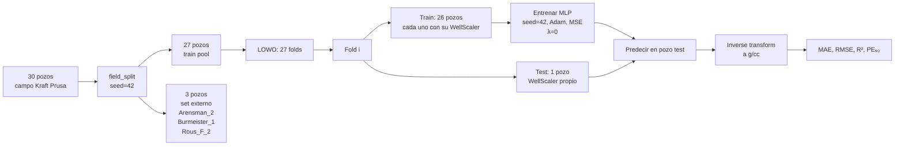

# 4. Modelo Base MLP — Evaluación LOWO

Establece el rendimiento de referencia del MLP supervisado puro (λ=0, sin restricción
física) sobre el campo Kraft Prusa mediante validación cruzada Leave-One-Well-Out.
Todas las métricas de la PINN (Phase 3) se comparan contra estos valores.

---

## 4.1 Introducción

El modelo base (*baseline*) es un MLP estándar entrenado con MSE puro sobre los datos
normalizados. Su propósito es doble:

1. **Cuantificar el límite inferior de la PINN**: λ=0 reproduce exactamente el baseline
   (verificado por `test_lambda_phys_zero_same_as_no_physics`).
2. **Establecer una referencia honesta**: el protocolo LOWO garantiza que ningún pozo de
   prueba contamina el entrenamiento, lo que hace comparables los resultados entre folds.

El pipeline de preprocesamiento Yeo-Johnson + z-score (implementado en Phase 2) produce
resultados significativamente mejores que el pipeline anterior con min-max:

| Pipeline | MAE medio (g/cc) | R² medio |
|---|---:|---:|
| Min-max per-well (pipeline anterior) | 0.183 | −0.174 |
| **Yeo-Johnson + z-score (pipeline actual)** | **0.134** | **0.414** |

---

## 4.2 Protocolo de evaluación LOWO

Cada fold es completamente independiente:

1. Los 26 pozos de entrenamiento se preprocesan individualmente con su propio `WellScaler`.
2. El pozo de prueba se preprocesa con su propio `WellScaler` — sin información cruzada.
3. El modelo se inicializa desde cero con `set_seed(42)` antes de cada fold.
4. Las predicciones se invierten a g/cc (mediante `WellScaler.inverse_transform_target()`)
   antes de calcular métricas.

El set externo (3 pozos) está reservado para la validación final de la PINN y no
participa en ningún fold LOWO ni en la calibración de hiperparámetros.

**Fuentes**: `src/lowo.py`, `scripts/03_train_baseline.py`

---

## 4.3 Arquitectura MLP

La arquitectura es deliberadamente simple: suficiente capacidad para aprender los
patrones del campo sin sobreajustar los pocos miles de muestras disponibles por fold.

| Capa | Dimensión entrada | Dimensión salida | Activación |
|---|---:|---:|---|
| Input | — | 5 | — |
| Hidden 1 | 5 | 64 | ReLU |
| Hidden 2 | 64 | 64 | ReLU |
| Hidden 3 | 64 | 32 | ReLU |
| Output | 32 | 1 | Ninguna (lineal) |

La salida lineal permite predicciones en cualquier rango real; la inversión mediante
`WellScaler` devuelve los valores a g/cc.

### 4.3.1 Configuración de entrenamiento

| Parámetro | Valor |
|---|---|
| Optimizador | Adam |
| Tasa de aprendizaje | 1×10⁻³ |
| Función de pérdida | MSE (espacio normalizado) |
| Épocas máximas | 500 |
| Early stopping patience | 30 épocas |
| min_delta early stopping | 1×10⁻⁵ |
| Fracción de validación interna | 15 % |
| Batch size | 256 |
| λ físico | 0.0 (baseline puro) |
| Semilla aleatoria | 42 (aplicada antes de cada fold) |

El checkpoint del mejor modelo (menor val loss durante el entrenamiento) se restaura al
finalizar para que la evaluación se haga sobre la mejor iteración del fold.

**Fuentes**: `src/model.py`, `src/train.py → TrainConfig`

---

## 4.4 Resultados por pozo

Métricas en **g/cc** (post inverse-transform), ordenadas por R² descendente.
PE₉₀ = percentil 90 del error absoluto.

| Pozo | MAE (g/cc) | RMSE (g/cc) | R² | PE₉₀ (g/cc) |
|---|---:|---:|---:|---:|
| Oeser_2 | 0.063 | 0.099 | 0.816 | 0.142 |
| Hoffman_2 | 0.067 | 0.103 | 0.778 | 0.141 |
| Oeser,_R__1 | 0.073 | 0.132 | 0.671 | 0.149 |
| Hoffman_Trust_1 | 0.063 | 0.104 | 0.669 | 0.131 |
| Nadine_1 | 0.069 | 0.107 | 0.667 | 0.146 |
| Grossardt_3 | 0.072 | 0.121 | 0.664 | 0.168 |
| Schneweis_10 | 0.041 | 0.058 | 0.644 | 0.089 |
| Soeken_12 | 0.154 | 0.200 | 0.637 | 0.315 |
| Beaver_S-Reif_1-22 | 0.079 | 0.118 | 0.625 | 0.161 |
| Kraft-Prusa_Unit_16 | 0.072 | 0.115 | 0.604 | 0.149 |
| Kroutwurst_19 | 0.040 | 0.061 | 0.577 | 0.086 |
| Woydziak-Kirmer_Unit_1 | 0.054 | 0.080 | 0.490 | 0.138 |
| Frees-Burmeister_13 | 0.044 | 0.068 | 0.487 | 0.091 |
| Rupe-Woydziak_Unit_1 | 0.133 | 0.184 | 0.485 | 0.286 |
| Rous_1-28 | 0.051 | 0.084 | 0.484 | 0.109 |
| Schneweis_3 | 0.134 | 0.193 | 0.471 | 0.308 |
| Wirth_5 | 0.108 | 0.172 | 0.437 | 0.238 |
| Holder_'A'_5 | 0.165 | 0.218 | 0.424 | 0.333 |
| Krier_'C'_6 | 0.238 | 0.301 | 0.332 | 0.487 |
| Weber_'A'_13 | 0.167 | 0.235 | 0.331 | 0.419 |
| Woydziak_'A'_1 | 0.200 | 0.269 | 0.258 | 0.465 |
| Demel_3 | 0.215 | 0.297 | 0.161 | 0.517 |
| Bieberle_Trust_2 | 0.278 | 0.388 | 0.093 | 0.716 |
| Kroutwurst_20 | 0.269 | 0.323 | 0.083 | 0.508 |
| Esfeld_9 | 0.165 | 0.226 | 0.082 | 0.357 |
| Kroutwurst_21 | 0.203 | 0.283 | −0.162 | 0.461 |
| Dolecheck_1 | 0.395 | 0.473 | −0.640 | 0.793 |

---

## 4.5 Métricas agregadas

Calculadas sobre los 27 folds del train pool (media y desviación estándar).

| Métrica | Media | Desv. std |
|---|---:|---:|
| MAE (g/cc) | **0.1338** | 0.0882 |
| RMSE (g/cc) | **0.1857** | 0.1056 |
| R² | **0.4137** | 0.3136 |
| PE₉₀ (g/cc) | **0.2927** | 0.1923 |

Resumen del rendimiento general:

- **25 de 27 pozos** presentan R² positivo.
- La **mediana de R² = 0.485** es más representativa del comportamiento típico que
  la media (la media está deprimida por Dolecheck_1 y Kroutwurst_21).
- Solamente Kroutwurst_21 (R²=−0.162) y Dolecheck_1 (R²=−0.640) tienen R² negativo.
  Dolecheck_1 está documentado como caso anómalo desde el EDA (NPHI 0.81–5.69 v/v).

---

## 4.6 Análisis y discusión

### 4.6.1 Pozos con buen rendimiento (R² > 0.6)

Ocho pozos alcanzan R² > 0.6, con el mejor en Oeser_2 (R²=0.816, MAE=0.063 g/cc).
Estos pozos comparten características favorables:

- Registros de buena calidad sin anomalías de unidad.
- Varianza de DEN suficientemente alta para que R² sea informativo.
- Respuesta de NPHI correlacionada con DEN (relación física activa en la formación).

Son los pozos donde la PINN debe mantener o mejorar el rendimiento sin degradar.

### 4.6.2 R² negativo con MAE bajo (Kroutwurst_21)

Kroutwurst_21 tiene MAE=0.203 g/cc y R²=−0.162. El R² negativo indica que el modelo
produce un sesgo sistemático que supera la varianza del target. Las posibles causas son:
heterogeneidad litológica no representada en los 26 pozos de entrenamiento del fold, o
señal NPHI degradada en este pozo. Es el principal candidato para observar si λ > 0
aporta regularización adicional.

### 4.6.3 Dolecheck_1 — outlier documentado

Dolecheck_1 tiene R²=−0.640 y MAE=0.395 g/cc. Está documentado como caso anómalo
desde el EDA: NPHI entre 0.81 y 5.69 v/v (inconsistencia de escala en el LAS original).
Tras el pipeline de preprocesamiento, NPHI queda prácticamente constante → el modelo no
recibe información de porosidad real para este pozo.

### 4.6.4 Bieberle_Trust_2

MAE=0.278 g/cc, PE₉₀=0.716 g/cc — el error en el percentil 90 más alto del conjunto.
El pozo tiene SP en escala absoluta (0–666 mV), lo que introduce ruido en la normalización
per-well pese al voting consensus. Candidato para el análisis de la PINN.

---

## 4.7 Implicaciones para el PINN

| Observación | Consecuencia para PINN (Phase 3) |
|---|---|
| 25/27 pozos con R² positivo | La PINN parte de una base sólida; objetivo: mantener o mejorar sin regresión |
| Mediana R² = 0.485 | Umbral de referencia para evaluar el beneficio neto de λ > 0 |
| Dolecheck_1 (R²=−0.640), NPHI constante | La restricción física DEN–NPHI no aportará señal útil donde NPHI es constante |
| MAE medio = 0.134 g/cc | Umbral cuantitativo; PINN con λ=0.1 logra MAE=0.131 g/cc |
| PE₉₀ medio = 0.293 g/cc | El 90% de los errores de predicción queda bajo ~0.29 g/cc |
| Set externo: {Arensman_2, Burmeister_1, Rous_'F'_2} | Reservados para Phase 4; evaluar PINN final vs. baseline en estos 3 pozos |

---

## 4.8 Fuentes

| Módulo | Ruta |
|---|---|
| Script de entrenamiento | `scripts/03_train_baseline.py` |
| Modelo MLP | `src/model.py` |
| Loop de entrenamiento | `src/train.py` |
| Métricas de evaluación | `src/evaluate.py` |
| Preprocesamiento | `src/preprocessing.py` |
| Splits LOWO | `src/lowo.py` |
| Resultados raw | `outputs/baseline/metrics.json` |
| Predicciones por pozo | `outputs/baseline/predictions/*.parquet` |
