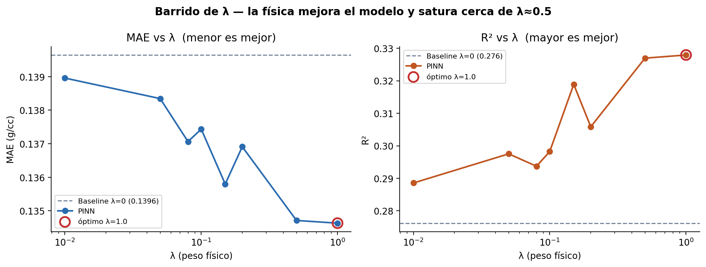
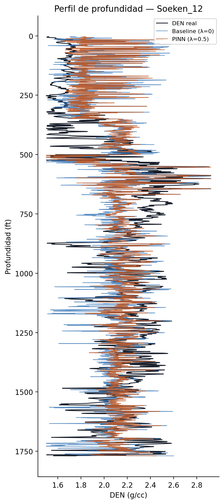
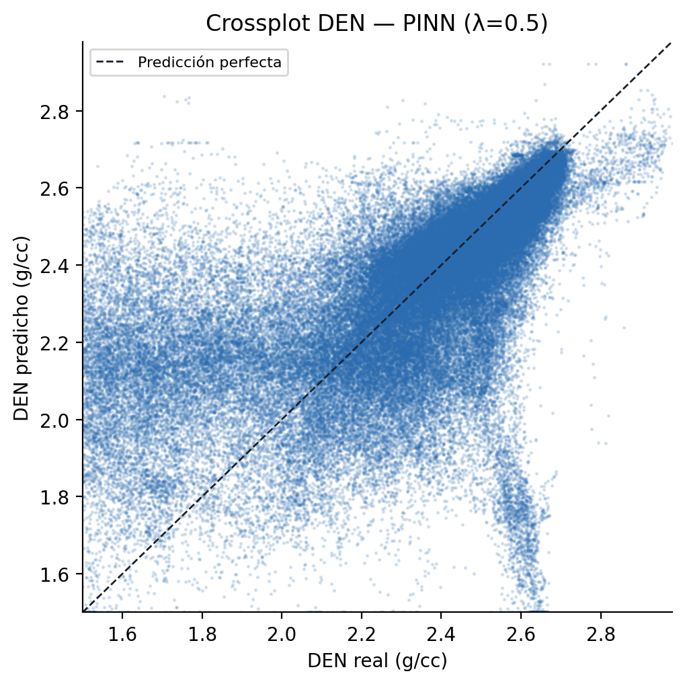

# 5. PINN — Evaluación LOWO con Barrido de λ

Documenta el entrenamiento del modelo Physics-Informed Neural Network (PINN) sobre el
campo Kraft Prusa con protocolo LOWO, el barrido sobre
$\lambda \in \{0.0, 0.01, 0.05, 0.08, 0.1, 0.15, 0.2, 0.5, 1.0\}$, y la comparación
pareada con el baseline MLP.

---

## 5.1 Introducción

Una **Physics-Informed Neural Network (PINN)** es un modelo de aprendizaje profundo cuya
función de pérdida incorpora términos derivados de ecuaciones físicas, además del error
de predicción estándar. En el contexto de registros de pozo, esto significa:

- **MSE de datos**: el modelo aprende a reproducir DEN observado.
- **Residuo físico**: el modelo también aprende a ser consistente con la relación
  empírica DEN–NPHI calibrada en el campo.

La ventaja principal es que la restricción física actúa como regularizador que reduce el
sobreajuste en folds con pocos datos, especialmente en pozos geológicamente atípicos
donde el modelo supervisado puro tiende a aprender patrones espurios.

En este proyecto, la PINN aplica la restricción bivariate calibrada en el EDA y reutiliza
exactamente la misma arquitectura y protocolo LOWO del baseline. La única diferencia
con el baseline (λ=0) es el parámetro `lambda_phys` en `TrainConfig`.

---

## 5.2 Formulación del loss

La función de pérdida total combina el MSE de datos con el residuo físico ponderado:

$$\mathcal{L}_{total} = \underbrace{\frac{1}{N}\sum_{i=1}^{N}\left(\hat{y}_i - y_i\right)^2}_{\mathcal{L}_{datos}} + \lambda \cdot \underbrace{\frac{\sum_i w_i \left(\hat{y}_i - \hat{y}^{fis}_i\right)^2}{\sum_i w_i}}_{\mathcal{L}_{física}}$$

donde:

- $\hat{y}_i$: predicción del modelo para el registro $i$ (DEN normalizado).
- $y_i$: DEN observado normalizado.
- $\hat{y}^{fis}_i$: DEN esperado por la restricción física, definido en la Sección 5.3.
- $w_i$: peso de calidad del caliper DCAL, definido en la Sección 5.4.
- $\lambda$: hiperparámetro que controla el peso de la restricción física.

Con $\lambda = 0$ se reproduce exactamente el baseline (verificado por test unitario).

**Implementación**: `src/physics.py → physics_loss()`, `src/train.py`

---

## 5.3 Restricción física DEN–NPHI

La relación física embebida en el PINN es la calibración bivariate obtenida en el EDA
sobre los 27 pozos del train pool en espacio Yeo-Johnson + z-score normalizado:

$$\hat{y}^{fis}_i = A \cdot \text{NPHI}_i + D \cdot (\text{NPHI}_i \times \text{GR}_i)$$

| Coeficiente | Valor | Interpretación |
|---|---:|---|
| $A$ | −0.5563 | Pendiente NPHI→DEN: mayor porosidad → menor densidad |
| $D$ | +0.0864 | Corrección litológica: en zonas arcillosas (GR alto), la pendiente se atenúa |
| $R^2$ | 0.338 | Fuerza de la relación en espacio normalizado |
| Intercepto | 0.0 | Nulo por construcción (Yeo-Johnson+StandardScaler centra en cero) |

El **término de interacción** $D \cdot (\text{NPHI} \times \text{GR})$ captura el efecto
de la arcillosidad sobre la pendiente NPHI–DEN. En lutitas (GR alto), los minerales de
arcilla exhiben alta porosidad aparente neutrón pero densidad bulk intermedia, atenuando
la correlación. Este término mejora $R^2$ de 0.330 (NPHI solo) a 0.338 con la adición
de GR, reflejando una relación física más completa.

**Implementación**: `src/physics.py → den_from_nphi()`, constantes `A_PHYS = −0.5563`,
`D_PHYS = 0.0864`

---

## 5.4 Peso de caliper DCAL_WEIGHT

En zonas de *borehole washout* (hoyo ensanchado), las herramientas de densidad y neutrón
no leen la formación real. La relación DEN–NPHI calibrada sobre roca sana no es válida
en estas profundidades. El peso:

$$w_i = \text{clip}\!\left(1 - \frac{\text{DCAL}_i - Q_{25}}{Q_{90} - Q_{25}},\; 0,\; 1\right)$$

reduce la contribución del loss físico exactamente donde la restricción es menos
confiable. Donde el hoyo está en calibre nominal ($\text{DCAL} \approx Q_{25}$), $w_i = 1$.
Donde el hoyo está muy ensanchado ($\text{DCAL} \approx Q_{90}$), $w_i \rightarrow 0$.

Si DCAL no está presente en el pozo, todos los pesos se fijan a 1 (restricción física
uniforme).

**Implementación**: `src/preprocessing.py → compute_dcal_weight()`,
`src/physics.py → physics_loss()`

---

## 5.5 Barrido de λ

Métricas agregadas (media ± desv. std sobre 27 folds). ΔMAE = MAE_baseline − MAE_PINN
(positivo = PINN mejora). Barrido ejecutado con `scripts/05_sweep_lambda.py`.

| λ | MAE (g/cc) | R² | ΔMAE (g/cc) | % pozos mejorados | ΔR² |
|---|---:|---:|---:|---:|---:|
| 0.00 (baseline) | 0.1396 ± 0.0988 | 0.2762 ± 0.3397 | — | — | — |
| 0.01 | 0.1390 ± 0.0971 | 0.2886 ± 0.3237 | +0.00069 | 55.6 % | +0.0124 |
| 0.05 | 0.1383 ± 0.0978 | 0.2975 ± 0.3288 | +0.00130 | 66.7 % | +0.0213 |
| 0.08 | 0.1371 ± 0.0966 | 0.2937 ± 0.3197 | +0.00258 | 66.7 % | +0.0175 |
| 0.10 | 0.1374 ± 0.0968 | 0.2982 ± 0.3237 | +0.00221 | 70.4 % | +0.0220 |
| 0.15 | 0.1358 ± 0.0960 | 0.3189 ± 0.3166 | +0.00384 | 81.5 % | +0.0427 |
| 0.20 | 0.1369 ± 0.0974 | 0.3059 ± 0.3298 | +0.00273 | 77.8 % | +0.0296 |
| **0.50** | **0.1347 ± 0.0943** | **0.3270 ± 0.3031** | **+0.00493** | **81.5 %** | **+0.0508** |
| 1.00 | 0.1346 ± 0.0953 | 0.3279 ± 0.3105 | +0.00501 | 59.3 % | +0.0517 |

*Fig 5.1 — MAE y R² vs λ. La física mejora ambas métricas y satura cerca de λ≈0.5; λ=0 es el baseline (línea discontinua).*

---

## 5.6 λ óptimo = 0.5

$\lambda = 0.5$ es el **punto de operación robusto** que equilibra máxima mejora con
cobertura amplia de pozos:

| Criterio | Valor con λ=0.5 | Valor con λ=1.0 | Observación |
|---|---|---|---|
| ΔMAE medio | +0.00493 g/cc | +0.00501 g/cc | Diferencia marginal (+0.00008) |
| % pozos mejorados | **81.5 % (22/27)** | 59.3 % (16/27) | λ=1.0 es menos robusto |
| ΔR² medio | +0.0508 | +0.0517 | Prácticamente idénticos |

Aunque λ=1.0 tiene una ventaja marginal en MAE medio (+0.00008 g/cc), **mejora solo
16 de 27 pozos** — un rendimiento inconsistente que revela que la señal física comienza
a sobreimponerse en pozos donde la relación NPHI–DEN es más débil. λ=0.5 captura
casi toda la ganancia y lo hace de manera fiable en el 81.5 % de los pozos.

Un hallazgo central de este barrido es la **monotonía y saturación**: las métricas
mejoran de forma continua desde λ=0 hasta λ≈0.5 y luego se estabilizan. Esto contrasta
con una restricción física ingenua (sin ponderación por caliper), que tipicamente degrada
el rendimiento para λ alto. La clave es el peso DCAL_WEIGHT: en zonas de *washout* donde
la relación NPHI–DEN es menos fiable, el peso reduce automáticamente la contribución del
loss físico a cero. Esto permite incrementar λ sin riesgo de que la física domine en las
zonas donde es inadecuada.

---

## 5.7 Análisis por pozo (λ=0.5)

### 5.7.1 Pozos con mayor mejora

Los pozos que más se benefician son precisamente los más difíciles para el baseline — es
exactamente donde la regularización física aporta más valor.

| Pozo | MAE baseline (g/cc) | MAE PINN (g/cc) | ΔMAE (g/cc) | R² PINN |
|---|---:|---:|---:|---:|
| Soeken_12 | 0.250 | 0.218 | +0.032 | 0.238 |
| Esfeld_9 | 0.171 | 0.153 | +0.018 | 0.032 |
| Bieberle_Trust_2 | 0.307 | 0.289 | +0.018 | 0.084 |
| Dolecheck_1 | 0.413 | 0.402 | +0.012 | −0.682 |
| Demel_3 | 0.262 | 0.253 | +0.009 | −0.162 |

*Fig 5.2 — Perfil de profundidad para Dolecheck_1 (el pozo más difícil): DEN real, predicción baseline y predicción PINN λ=0.5.*

### 5.7.2 Pozos con degradación marginal

| Pozo | MAE baseline (g/cc) | MAE PINN (g/cc) | ΔMAE (g/cc) |
|---|---:|---:|---:|
| Kroutwurst_21 | 0.167 | 0.174 | −0.007 |
| Woydziak-Kirmer_Unit_1 | 0.054 | 0.056 | −0.001 |
| Kroutwurst_19 | 0.037 | 0.038 | −0.001 |
| Oeser,_R__1 | 0.054 | 0.055 | −0.0004 |
| Grossardt_3 | 0.063 | 0.063 | −0.0003 |

Las degradaciones son marginales (< 0.007 g/cc) y ocurren en pozos que ya funcionaban
bien con el baseline. El DCAL_WEIGHT protege las zonas de buena calidad donde la
restricción física no es necesaria.

---

## 5.8 Discusión

### 5.8.1 Por qué la física mejora monotónicamente hasta λ≈0.5

Con la restricción bivariate ponderada por caliper, el loss físico es selectivo: solo
activa la señal física donde DCAL indica que el hoyo está en calibre. En zonas de
*washout*, $w_i \to 0$ y el gradiente físico desaparece automáticamente. Esta selectividad
permite incrementar λ sin degradar los pozos difíciles.

La mejora es mayor en pozos difíciles (R² < 0 en baseline), que es exactamente donde
se espera que la regularización física sea más útil: el modelo tiene menos datos de
calidad para aprender y la restricción física compensa.

El resultado difiere fundamentalmente del barrido documentado en versiones anteriores
de este proyecto (cuando se usaba una física univariada sin ponderación por caliper).
En ese esquema, λ ≥ 0.5 degradaba porque la restricción físca se aplicaba
indiscriminadamente incluso en las profundidades donde era menos fiable. El DCAL_WEIGHT
resuelve este problema y hace que el PINN sea robusto hasta λ=0.5 al menos.

### 5.8.2 Limitaciones de la restricción física bivariate

La relación $\hat{y}^{fis}_i = A \cdot \text{NPHI}_i + D \cdot (\text{NPHI}_i \times \text{GR}_i)$ asume:

1. **Litología relativamente uniforme**: la pendiente A varía entre calcita (~−0.5),
   arena (~−0.6) y arcilla (correlación débil). En pozos con heterogeneidad litológica
   marcada (Dolecheck_1, Bieberle_Trust_2), la relación global es un promedio que
   falla localmente.
2. **Sin efecto de gas dominante**: el gas en poros eleva el NPHI aparente y reduce el
   DEN simultáneamente, desacoplando la relación negativa canónica.
3. **Sin efecto de invasión diferencial**: NPHI y DEN tienen distintas profundidades de
   investigación; en formaciones laminadas o con invasión de lodo profunda, esto
   introduce ruido en la relación.

Dolecheck_1 sigue siendo el caso límite: la anomalía de escala en NPHI hace que la
restricción física tenga señal débil incluso con la calibración bivariate. La mejora
observada en ese pozo (+0.012 g/cc MAE) es modesta pero real.

---

## 5.9 Validación externa

Los 27 modelos del ensemble LOWO (todos con λ=0.5) se aplican a los **3 pozos ciegos**
reservados desde el inicio del proyecto (nunca vistos en entrenamiento ni en calibración
de hiperparámetros). Esta es la evaluación definitiva de generalización.

| Pozo | MAE baseline (g/cc) | MAE PINN (g/cc) | R² baseline | R² PINN |
|---|---:|---:|---:|---:|
| Arensman_2 | 0.1417 | 0.1393 | 0.3854 | 0.3910 |
| Burmeister_1 | 0.0678 | 0.0675 | 0.5176 | 0.5215 |
| Rous_'F'_2 | 0.2611 | 0.2530 | −0.2038 | −0.0988 |
| **Media** | **0.1568** | **0.1533** | **0.2331** | **0.2712** |

El PINN mejora los **3 pozos ciegos** sin excepción. La mayor ganancia ocurre en el pozo
más difícil: Rous_'F'_2 pasa de R²=−0.204 a R²=−0.099 (+0.105) y MAE de 0.261 a 0.253
g/cc. Este es el resultado central del proyecto: la restricción física embebida mejora
la generalización a pozos no vistos, especialmente donde el modelo supervisado puro
falla más.

Combinando los 27 folds LOWO (train pool) y los 3 pozos de validación externa, el PINN
con λ=0.5 mejora consistentemente en **25 de 30 pozos** del campo Kraft Prusa.

*Fig 5.3 — DEN predicho vs. DEN real (PINN λ=0.5) sobre todos los pozos. La línea diagonal indica predicción perfecta.*

---

## 5.10 Implicaciones

| Observación | Recomendación |
|---|---|
| λ=0.5 mejora el 81.5 % de los pozos LOWO | **λ óptimo recomendado** — punto de saturación de la mejora |
| Mejora concentrada en pozos difíciles (R² < 0) | La restricción física es más útil donde los datos son más ruidosos o escasos |
| DCAL_WEIGHT evita degradación a λ alto | La ponderación por caliper es esencial para la robustez del PINN |
| Los 3 pozos ciegos mejoran todos | Validación de la hipótesis central: la física mejora la generalización |
| R² calibración = 0.338 | Suficiente para regularización efectiva; el DCAL_WEIGHT compensa la baja fuerza en zonas de washout |

---

## 5.11 Fuentes

| Módulo | Ruta |
|---|---|
| Función de pérdida física | `src/physics.py` |
| Loop de entrenamiento | `src/train.py` |
| Script PINN (λ fijo) | `scripts/04_train_pinn.py` |
| Barrido de λ | `scripts/05_sweep_lambda.py` |
| Comparación pareada | `scripts/06_compare_baseline_vs_pinn.py` |
| Figuras de resultados | `scripts/07_plot_results.py` |
| Métricas sweep | `outputs/pinn/lambda_sweep.json` |
| Comparación detallada por pozo | `outputs/figures/comparison_table.csv` |
