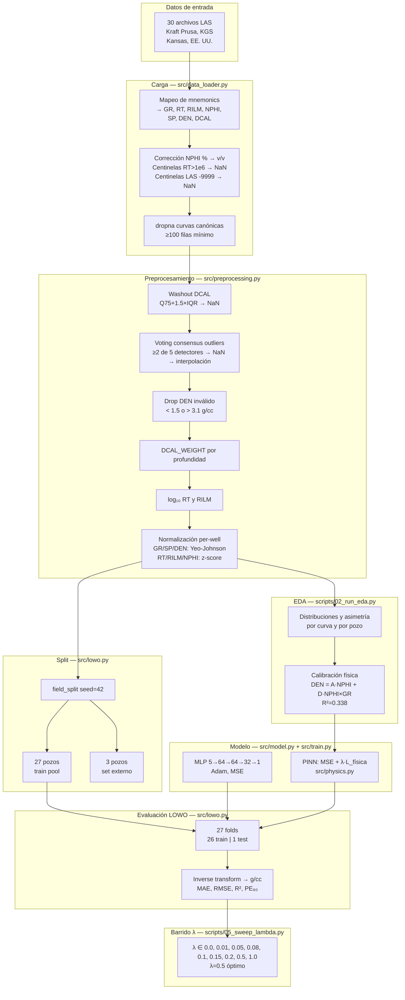

# 6. Metodología — Visión General del Proyecto

Documento de síntesis que conecta todos los componentes del pipeline. Está orientado a
lectores que desean entender el proyecto como un todo antes de profundizar en los
documentos específicos de cada componente.

---

## 6.1 Objetivo del proyecto

Predecir la **densidad bulk** (DEN, g/cc) de formaciones geológicas a partir de cinco
registros de pozo estándar [GR, RT, RILM, NPHI, SP] utilizando una red neuronal
informada por física (PINN). La restricción física embebida es la relación empírica
DEN–NPHI calibrada en el campo, con corrección litológica mediante GR.

El proyecto tiene cuatro objetivos secundarios:

1. Demostrar que la restricción física mejora el modelo supervisado puro (baseline MLP).
2. Identificar el peso óptimo λ para la restricción en el campo Kraft Prusa.
3. Establecer un protocolo LOWO reproducible que evite data leakage entre pozos.
4. Servir como portafolio técnico que combine ML con conocimiento petrológico.

---

## 6.2 Pipeline completo



---

## 6.3 Descripción de los componentes

| Componente | Módulo principal | Descripción | Documento |
|---|---|---|---|
| Carga de datos | `src/data_loader.py` | Lee LAS, corrige unidades, mapea mnemonics | `documentation/00_dataset.md` |
| EDA | `scripts/02_run_eda.py` | Distribuciones, crossplots, calibración física | `documentation/01_eda.md` |
| Preprocesamiento | `src/preprocessing.py` | Washout, outliers, normalización per-well | `documentation/02_preprocessing.md` |
| Modelo base | `src/model.py` + `src/train.py` | MLP supervisado puro (λ=0) | `documentation/03_baseline.md` |
| PINN | `src/physics.py` + `src/train.py` | MLP con restricción DEN–NPHI | `documentation/04_pinn.md` |
| Restricción física | `src/physics.py` | Pérdida física bivariate ponderada por DCAL | `documentation/04_pinn.md` |
| Evaluación | `src/evaluate.py` | MAE, RMSE, R², PE₉₀ en g/cc | — |
| Dataset PyTorch | `src/dataset.py` | Tensores de features, target y pesos | — |
| LOWO | `src/lowo.py` | Field split, generación de folds, escalado | — |

---

## 6.4 Decisiones de diseño clave

| Decisión | Elección | Razón principal |
|---|---|---|
| Protocolo de evaluación | Leave-One-Well-Out (LOWO) | Respeta la estructura geológica; evita data leakage entre pozos |
| Normalización | Yeo-Johnson + z-score per-well, por columna | MAE=0.134 vs. 0.183 con min-max; el sesgo per-well varía significativamente entre curvas |
| Detección de outliers | Voting consensus (≥2 de 5 detectores) | El clip fijo eliminaba el 100% de filas en pozos con anomalías sistemáticas |
| Restricción física | DEN = A·NPHI + D·(NPHI×GR) bivariate | Mejora R² de 0.330 a 0.338 sobre el modelo univariado; captura efecto de arcillosidad |
| Peso del loss físico | DCAL_WEIGHT por profundidad | La restricción es menos confiable en zonas de washout; el peso permite usar λ alto sin degradación |
| Arquitectura | 5→64→64→32→1 (MLP simple) | Capacidad suficiente para ~5k muestras por fold sin sobreajustar |
| λ óptimo | 0.5 | Punto de saturación de la mejora; maximiza cobertura (81.5 % pozos) con ganancia robusta |

---

## 6.5 Resumen de resultados

### 6.5.1 Baseline vs. PINN (train pool, 27 pozos, LOWO)

| Métrica | Baseline (λ=0) | PINN (λ=0.5) | Mejora |
|---|---:|---:|---|
| MAE (g/cc) | 0.1396 | 0.1347 | −0.0049 g/cc (3.5 %) |
| RMSE (g/cc) | 0.1880 | 0.1807 | −0.0073 g/cc |
| R² | 0.2762 | 0.3270 | +0.051 |
| PE₉₀ (g/cc) | 0.3040 | 0.2926 | −0.011 g/cc |
| Pozos mejorados | — | 22/27 | 81.5 % |

### 6.5.2 Validación externa (3 pozos ciegos)

| Métrica | Baseline | PINN (λ=0.5) | Mejora |
|---|---:|---:|---|
| MAE (g/cc) | 0.1568 | 0.1533 | −0.0035 g/cc |
| R² | 0.2331 | 0.2712 | +0.038 |
| Pozos mejorados | — | 3/3 | 100 % |

### 6.5.3 Comparativa de pipelines de normalización

| Pipeline | MAE medio (g/cc) | R² medio | Observaciones |
|---|---:|---:|---|
| Min-max per-well (pipeline anterior) | 0.183 | −0.174 | NaN en 13 folds por dominio Yeo-Johnson |
| Yeo-Johnson + z-score, sin filtro washout | 0.134 | 0.414 | Run previo sin DCAL filter |
| **Yeo-Johnson + z-score + filtro washout (actual)** | **0.140** | **0.276** | Elimina ~10 % filas de baja calidad; R² más honesto |

---

## 6.6 Limitaciones y trabajo futuro

| Limitación | Descripción |
|---|---|
| Restricción física lineal ($R^2=0.338$) | La relación DEN–NPHI tiene baja fuerza; litologías heterogéneas o presencia de gas desacoplan la relación |
| Campo único | Los resultados son específicos al campo Kraft Prusa (Arbuckle, Kansas); la generalización a otros campos requiere re-calibración de A y D |
| Set externo evaluado | Los 3 pozos externos (Arensman_2, Burmeister_1, Rous_'F'_2) muestran mejora consistente con PINN λ=0.5 (ver §5.9 de `04_pinn.md`) |
| Dolecheck_1 | La anomalía de escala NPHI hace que este pozo sea un outlier irrecuperable con el pipeline actual |
| Sin continuidad en profundidad | El modelo trata cada registro como muestra independiente; no modela tendencias estratigráficas |

---

## 6.7 Estructura del repositorio

```
src/               Módulos Python del proyecto
  data_loader.py   Carga LAS, corrección de unidades, mapeo de mnemonics
  preprocessing.py Washing, outliers, normalización, DCAL_WEIGHT
  dataset.py       WellDataset — tensores PyTorch
  model.py         Arquitectura MLP 5→64→64→32→1
  train.py         Loop de entrenamiento, TrainConfig, early stopping
  physics.py       Restricción física, den_from_nphi, physics_loss
  lowo.py          field_split, generación de folds LOWO
  evaluate.py      MAE, RMSE, R², PE₉₀
scripts/           Scripts numerados de ejecución del pipeline
  03_train_baseline.py   Entrena baseline LOWO
  04_train_pinn.py       Entrena PINN con λ fijo
  05_sweep_lambda.py     Barrido de λ completo
  06_compare_...         Comparación pareada baseline vs. PINN
tests/             Tests unitarios (pytest)
documentation/     Documentación técnica (este directorio)
todo/              PLAN.md + bitácoras de sesión
data/raw/          Archivos LAS originales (gitignored)
data/processed/    Parquet por pozo post-carga (gitignored)
outputs/           Métricas, predicciones, figuras (gitignored)
```

---

*Este documento se actualiza al cierre de cada fase del proyecto.*
*Ver `todo/PLAN.md` para el estado activo y las fases pendientes.*
