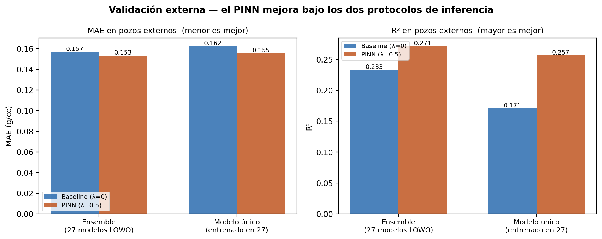
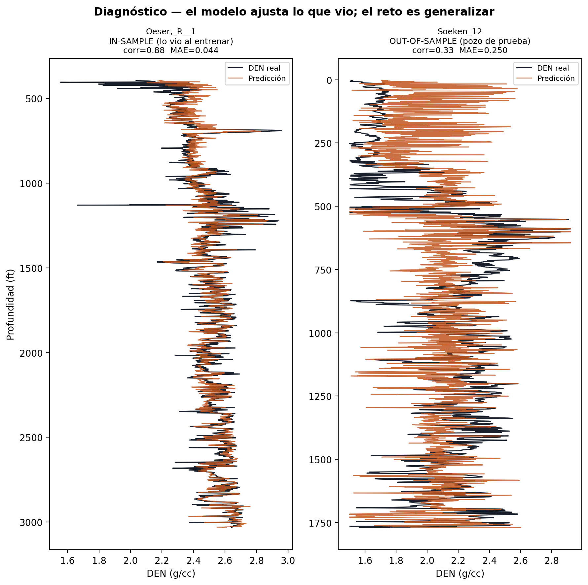

# 7. Resultados y Validación por Metodología

Capítulo de cierre del proyecto. Resume los resultados de validación del PINN y documenta
la **decisión de diseño** de evaluar los pozos ciegos bajo **dos protocolos de inferencia
independientes**, como análisis de robustez de la ventaja física.

---

## 7.1 Resumen de resultados

El proyecto valida la hipótesis central — *embeber física en la pérdida mejora la
generalización* — en dos niveles complementarios:

| Nivel de validación | Protocolo | Resultado PINN (λ=0.5) vs baseline |
|---|---|---|
| **Interno (LOWO, 27 pozos)** | 27 folds, cada pozo de prueba una vez | Mejora el **81.5 %** de los pozos; MAE 0.140→0.135, R² 0.276→0.327 |
| **Externo (3 pozos ciegos)** | Ensemble de 27 modelos | MAE 0.157→0.153, R² 0.233→0.271 |
| **Externo (3 pozos ciegos)** | Modelo único entrenado en 27 | MAE 0.162→0.155, R² 0.171→0.257 |

El LOWO es la validación **principal** (27 pruebas ciegas independientes). El set externo es
la confirmación **final** sobre pozos reservados desde el inicio, nunca usados ni en
entrenamiento ni en selección de hiperparámetros.

---

## 7.2 Los dos protocolos de inferencia — decisión de diseño

Los 3 pozos externos no pertenecen a ningún fold LOWO, así que **ningún modelo "les
corresponde"**. Hay dos formas legítimas de predecirlos, y este proyecto reporta ambas:

### Protocolo A — Ensemble de los 27 modelos LOWO
Se promedian las predicciones de los 27 modelos entrenados durante el LOWO (cada uno entrenó
sobre 26 pozos distintos). Es una forma de *bagging*: reduce la varianza al promediar modelos
con datos de entrenamiento ligeramente distintos.

### Protocolo B — Modelo final único
Se entrena **un solo modelo** sobre los 27 pozos del train pool y se evalúa en los 3 externos.
Es el protocolo estándar de despliegue ("entrena en train, evalúa en test") y el más simple de
explicar y reproducir en producción.

**Implementación**: `src/external_eval.py` (`ensemble_predict`, `train_final_model`,
`predict_well`); `scripts/10_external_validation.py`.

### Por qué importa reportar ambos

El objetivo **no** es comparar métodos de inferencia, sino **validar el PINN**. Lo que prueba
el PINN es el *delta* baseline(λ=0)→PINN(λ=0.5) **dentro del mismo protocolo** — ambos
protocolos se aplican idénticos a baseline y PINN, así que cada comparación es justa.

Usar los dos es un **análisis de robustez**: si el PINN mejora bajo los dos protocolos, la
ventaja es real y no un artefacto del método de agregación. Cada protocolo además enseña algo:
- El **ensemble** mide cuánto ayuda promediar (robustez por bagging).
- El **modelo único** mide el comportamiento realista de despliegue, sin esa ayuda.

---

## 7.3 Tabla comparativa

Media sobre los 3 pozos ciegos. ΔMAE = baseline − PINN (positivo = mejora); ΔR² = PINN − baseline.

| Protocolo | MAE base | MAE PINN | ΔMAE | R² base | R² PINN | ΔR² |
|---|---:|---:|---:|---:|---:|---:|
| Ensemble (27 LOWO) | 0.1568 | 0.1533 | +0.0035 | 0.2331 | 0.2712 | +0.0381 |
| Modelo único | 0.1623 | 0.1553 | +0.0070 | 0.1708 | 0.2565 | +0.0857 |

Detalle por pozo (R²):

| Pozo | Ensemble base→PINN | Único base→PINN |
|---|---|---|
| Arensman_2 | 0.385 → 0.391 | 0.299 → 0.359 |
| Burmeister_1 | 0.518 → 0.521 | 0.460 → 0.521 |
| Rous_'F'_2 | −0.204 → −0.099 | −0.247 → −0.110 |

*__Fig. 7.1__ — MAE y R² medios en los 3 pozos ciegos. El PINN (naranja) mejora a la baseline
(azul) bajo los dos protocolos. La mejora es mayor en el modelo único.*

---

## 7.4 Robustez del PINN

**El PINN mejora a la baseline bajo los dos protocolos**, en MAE y en R², sin excepción. La
ventaja física no depende del método de agregación → es real.

Un hallazgo adicional: la mejora del PINN es **mayor en el modelo único** (ΔR² = +0.086) que en
el ensemble (ΔR² = +0.038). El ensemble ya reduce la varianza promediando 27 modelos, lo que
sube el baseline (R² 0.171 → 0.233); cuando no se dispone de esa reducción (un solo modelo), la
**regularización física compensa parcialmente esa robustez** y el aporte del PINN es más
visible. En otras palabras: la física aporta más cuando más se necesita.

La mayor ganancia ocurre, en ambos protocolos, en el pozo más difícil — **Rous_'F'_2**, que
pasa de R² ≈ −0.2 a ≈ −0.1. Es exactamente donde se espera que la restricción física ayude:
donde el modelo supervisado puro falla por falta de datos representativos.

---

## 7.5 Diagnóstico — ¿modelo o generalización?

Una pregunta natural: cuando la predicción se aleja de la curva real (p. ej. en pozos
difíciles), ¿el límite es el **modelo** (capacidad insuficiente) o la **generalización** (el
pozo no está bien representado por los demás)? Para responderlo, se usa el **mismo modelo** de
un fold LOWO para predecir un pozo que **sí vio** al entrenar (in-sample) y el pozo de prueba
que **no vio** (out-of-sample).

| Pozo | Correlación pred-real | MAE (g/cc) |
|---|---:|---:|
| Oeser,_R__1 (in-sample) | 0.88 | 0.044 |
| Soeken_12 (out-of-sample) | 0.33 | 0.250 |

*__Fig. 7.2__ — Mismo modelo: ajuste sobre un pozo de entrenamiento (izquierda, corr 0.88) vs
el pozo de prueba (derecha, corr 0.33). La predicción sigue de cerca la curva real en
entrenamiento.*

**Conclusión del diagnóstico**: el modelo **ajusta muy bien lo que vio** (correlación 0.88,
MAE 0.044 g/cc en entrenamiento). La arquitectura MLP no es el cuello de botella. El reto es la
**generalización** a pozos cuya geología no está bien representada por los otros 26 — y es ahí
donde el PINN aporta. La leve compresión de varianza observada (la predicción es algo más
"suave" que el registro real) es en parte correcta: el modelo no debe perseguir el ruido de
alta frecuencia de la herramienta.

---

## 7.6 Conclusiones del proyecto

1. **La física mejora la generalización.** El PINN supera a la baseline en el 81.5 % de los
   pozos LOWO y en los 3 pozos ciegos, bajo dos protocolos de inferencia independientes.
2. **El efecto es robusto y mayor donde más se necesita** — en pozos difíciles (Rous_'F'_2) y
   cuando no se dispone de la robustez del ensemble (modelo único).
3. **El peso de caliper (DCAL_WEIGHT) hace segura la física fuerte.** Al apagar la restricción
   en zonas de washout, el PINN tolera λ alto sin degradar — la mejora satura cerca de λ≈0.5.
4. **El modelo es adecuado; el límite es la generalización geológica.** El diagnóstico
   in-sample confirma que la arquitectura ajusta bien los datos vistos.

La mejora absoluta es modesta (MAE ~2–4 % relativo) — coherente con que la relación DEN–NPHI
lineal es una aproximación (R²=0.338 en espacio normalizado), no una ley exacta. El valor del
proyecto está en demostrar, con un protocolo riguroso, que **embeber conocimiento físico en la
pérdida es un regularizador efectivo y robusto** para predicción de registros en pozos no
vistos.

---

## 7.7 Fuentes

| Componente | Ruta |
|---|---|
| Módulo de inferencia externa | `src/external_eval.py` |
| Validación por dos protocolos | `scripts/10_external_validation.py` |
| Figuras de diagnóstico | `scripts/09_plot_diagnostics.py` |
| Métricas comparativas | `outputs/external/validation_comparison.json` |
